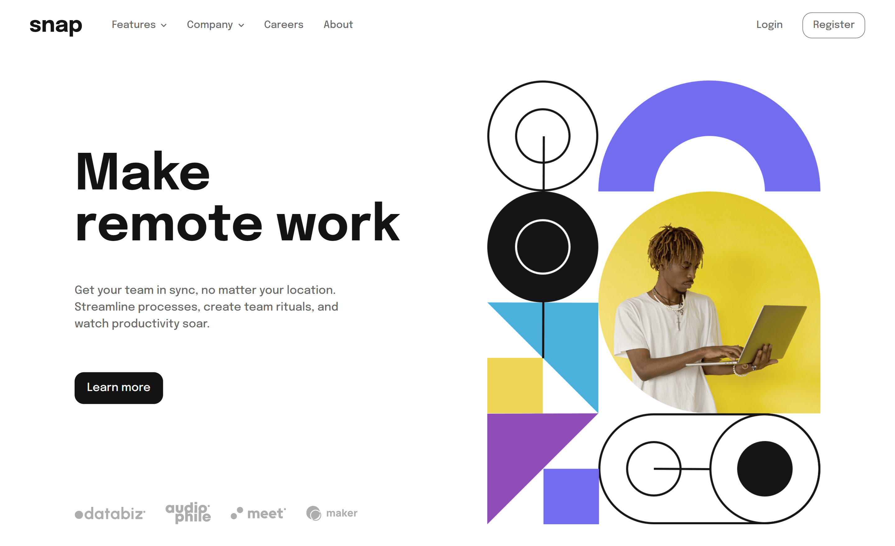

# Frontend Mentor - Intro section with dropdown navigation solution

This is a solution to the [Intro section with dropdown navigation challenge on Frontend Mentor](https://www.frontendmentor.io/challenges/intro-section-with-dropdown-navigation-ryaPetHE5). Frontend Mentor challenges help you improve your coding skills by building realistic projects.

## Table of contents

- [Overview](#overview)
  - [The challenge](#the-challenge)
  - [Screenshot](#screenshot)
  - [Links](#links)
- [My process](#my-process)
  - [Built with](#built-with)
  - [What I learned](#what-i-learned)
  - [Useful resources](#useful-resources)
- [Author](#author)
- [Acknowledgments](#acknowledgments)

## Overview

### The challenge

Users should be able to:

- View the relevant dropdown menus on desktop and mobile when interacting with the navigation links
- View the optimal layout for the content depending on their device's screen size
- See hover states for all interactive elements on the page

### Screenshot

### Links

- Solution URL: [https://github.com/ralphvirtucio/intro-section-with-dropdown-nav](https://github.com/ralphvirtucio/intro-section-with-dropdown-nav)
- Live Site URL: [https://ralphvirtucio.github.io/intro-section-with-dropdown-nav/](https://ralphvirtucio.github.io/intro-section-with-dropdown-nav/)

## My process

### Built with

- Semantic HTML5 markup
- CSS custom properties
- Flexbox
- CSS Grid
- Mobile-first workflow

### What I learned

I learn how to build an accessible disclosure.

### Useful resources

- [Disclosure resource 1](https://fedmentor.dev/posts/disclosure-ui/) - This helped me for building the mobile menu navigation and disclosures dropdown. I really liked this pattern and will use it going forward.

## Author

- Website - [Ralph Virtucio](https://ralphvirtucio.github.io/personal-portfolio/)
- Frontend Mentor - [@ralphvirtucio](https://www.frontendmentor.io/profile/ralphvirtucio)
- Twitter - [@frontendralph](https://www.twitter.com/frontendralph)

## Acknowledgments

I would like to give a hat tip on this <a href="https://fedmentor.dev/posts/disclosure-ui/">website</a> , It really helps me building my mobile navigation and dropdowns with accessiblity in mind
